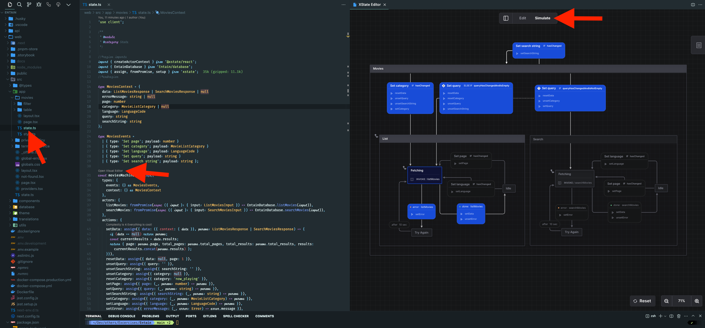

## SUMMARY
Aside from the requirements of this exercise, here are some of the things I've done that you might find interesting:

- `Translations`: the app is fully translated to English, Estonian and Russian. Other languages can be added easily.
- `Theming`: the app is fully themable and currently supports light and dark themes. Other themes can be added easily.
- `PWA`: the app is PWA compatible and can be installed on user's device.
- `Testing`: the app is configured for unit testing using `jest` both on `frontend` and `backend`.
- `Caching`: basic query caching is handled by `Nextjs`'s [fetch augmentation](https://nextjs.org/docs/app/building-your-application/data-fetching/fetching). I didn't implement any caching for the `API` as I don't think it's necessary for this exercise.
- `Storybook`: the `Web` module is configured for [Storybook](https://storybook.js.org/) development. See the [README](web/README.md) for more information.
- `Error handling`: on the `Web` I setup global error handling routes, fallback components, and error boundaries using `react-error-boundary`. On the `API`, I setup global exception filters to handle errors and return appropriate and consistent responses.
- `Rate limiting`: Basic rate limiting is setup with `Nestjs`'s [throttler module](https://docs.nestjs.com/techniques/throttling).
- `Makefile`: a [Makefile](Makefile) is included with commands to help with development and deployment.
- `Docker`: all modules are containerized using `Docker`. Commands for building the images are available in the [Makefile](Makefile). Docker compose is also configured to run the containers.
- `Deployment`: all modules are deployed on `AWS`. More on this later.
- `Documentation`: I added code documentation to all modules using `TypeDoc`. On the `API`, `Swagger` is also configured.

## ASSUMPTIONS
- I quickly skimmed the [TMDB API documentation](https://developer.themoviedb.org/reference/intro/getting-started), so I may have missed some details. My implementation is based on the assumption that there are two separate endpoints for listing and searching movies.
- I used [Next.js](https://nextjs.org/) on the frontend. I assume that the `React` requirement is also met by using the `Next.js` framework.

## TIPS
As mentioned in this [README](web/README.md), I use `xstate` to manage the state of the `Web` application.
One of the benefits of `xstate` is the ability to visualize the state machine and manually trigger events and see the state changes.
You will need to install the official [XState VSCode](https://marketplace.cursorapi.com/items?itemName=statelyai.stately-vscode) extension to take advantage of this feature. Below is an example of how to visualize the `Movies` state machine.

You can also see unit tests for the `Movies` state machine in the [state.test.ts](web/src/app/movies/state.test.ts) file. The tests are far from exhaustive, but you get the idea.

## NOTES
- In addition to using `Nextjs` on the frontend, I also used [Nest.js](https://nestjs.com/) on the backend and prefer [Docker](https://www.docker.com/). For these reasons, deploying all modules on AWS seemed like the best option as opposed to deploying the Web module on GitHub Pages.
- I use a wide screen, so my lines tend to be longer than 80 characters. I personally find the 80 character line rule rather limiting and outdated.
- To keep things simple, filtering by category is disabled at the medium screen breakpoint downwards. In a real application one could implement a dropdown menu to filter by category or a swipeable drawer with all necessary filters instead of limiting functionality on smaller screens like I've done. Implementing such functionality is trivial (MUI has a swipeable drawer component out of the box that takes care of half the problem), just time consuming - I don't think that's necessary for this exercise.

See more notes in the following `README.md` files

- [Base](README.md)
- [Web](web/README.md)
- [API](api/README.md)

## What's Missing?
I was told that I have 2 weeks to complete this exercise. That means I have another week and a half to work on this if I felt like it was necessary.
I understand this, but I think what I done so far suffices to help you make an informed decision on my skills and style.
That said, what would I do if I worked on this for another week and a half? Well aside from adding more UI features like additional filters, sorting, details view for movies etc. I would also:

- Setup E2E testing with something like [Cypress](https://www.cypress.io/) or [Playwright](https://playwright.dev/)
- Setup CI/CD pipelines with [Github Actions](https://github.com/features/actions) or [AWS CodePipeline](https://aws.amazon.com/codepipeline/)
- Setup monitoring and observability with [Grafana](https://grafana.com/), [Prometheus](https://prometheus.io/) and [Loki](https://grafana.com/oss/loki/)
- Think a bit more about the caching strategy
- Improve the rate limiting system probably more on the infrastructure side (`AWS`)
- Setup a proper logging system probably with [Pino](https://github.com/pinojs/pino)
- Maybe add Authentication and Authorization (I'm not sure if this is necessary)
- Setup [Sentry](https://sentry.io/) for error monitoring
- Setup stress testing probably with [Artillery](https://artillery.io/)
- etc.
